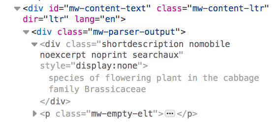

---  
layout: hunter_post  
title: requests, loops, and regex
permalink: /class12/  
categories: 
tags: 
assignment: continue work on final project -- by now you will have a functioning prototype, and be thinking about the interface in greater depth. Have a think on any topics you'd like to explore more, or revisit, and add them to the google sheet for next class.
description: 
assignment-due: 05/03
---  

By now, you should all have a good basis for your final project, and be able to discuss the structure in detail. While you might not have an interface yet to show, your blog should contain some discussion and sketches of the form that it might take, and a plan for what technologies you will use to achieve it. If you're struggling, I've blocked out time at the end of this class for you to work on your pieces and talk to me if you need any help.

## lecture: simulation demo pt ii -- requests, loops and regex

This class will explore 2 related but distinct themes that are probably worth covering/revisiting. The first is callbacks: specifically, using async javascript to do neat stuff like HTTP requests and timing loops, while keeping track of things like scope.

The *second* idea, which we've not met before, is the regular expression! These are super useful in a bunch of contexts, but I find myself getting the most mileage out of them in places like HTTP requests, where you often need to tidy up information you've got from elsewhere.

Like last week, I've been adding to the simulation demo as an example of how you might want to structure and integrate these things into your project. It's by no means prescriptive, though especially if you're trying to work out what order things like HTTP requests should happen in, and how to structure loops etc, you're more than welcome to use this as a template.

### revisiting requests

We've already spent some time on HTTP requests in this class, so this is mostly a short refresher, and a reminder of the notes [here](https://webdevelopm.net/fetch_intro/).

Key things to remember:
* most requests will need some kind of CORS treatment, to prevent a 'cross-origin' error. The quickest and easiest way to achieve this is to use CORS-anywhere: paste `https://cors-anywhere.herokuapp.com/` *before* the full url of the HTTP address you're making a request to, and it should resolve most issues
* HTTP requests are *not immediate*, and need to be handled by callbacks. For `fetch`, the convention is to use two chained arrow functions, with the `.then()` promise keyword. `.then` indicates to the browser to run this code *only after* the previous function has returned, and is a neat way of handling asynchronous requests.

```
fetch("https://cors-anywhere.herokuapp.com/https://api.darksky.net/forecast/c0d72b078c4f27a37169a2a3638dad3e/42.3601,-71.0589")
  .then((response) => {
    return response.json();
  })
  .then((myJson) => {
    printData(myJson)
  });
```

* *only* `return response.json();` if you're expecting to get data as JSON! This is true of most API requests, but *not* for requests that return HTML, like the ones your browser makes. As we'll see in a second, those more scrap-ey requests require `response.text()`

### a tiny bit of web scraping

For my foraging simulator, I've decided to use HTTP requests to Wikipedia to get some information about the plants I'm picking. The wikimedia API is primarily for getting metadata *about* a page (e.g. edit history, authors, changes), rather than the text of the page itself, so I'm going to use fetch to get the raw HTML of the page that I'm interested in, and then use jQuery to parse it.

```
fetch('https://cors-anywhere.herokuapp.com/https://en.wikipedia.org/wiki/' + requestString)
.then((response) => {
	return response.text();
}).then((data) => {
	var infoDiv = $('div .shortdescription', $(data));
	console.log(plant, infoDiv[0].innerHTML)
	plant.info = infoDiv[0].innerHTML;
});
```

This uses `fetch` to get the raw HTML, which gets parsed using `response.text()` (rather than `response.json()`). In order to know what parts of the page we want, let's look at an [example Wikipedia page](https://en.wikipedia.org/wiki/Alliaria_petiolata).

We can see that there's a div with class `shortdescription`, which contains a very short paragraph about the plant. This is a particular feature of Wikipedia pages, but one that I'm going to use here as the infomration!



```
var infoDiv = $('div .shortdescription', $(data));
```

This line selects a HTML element, using jQuery to process the HTML data from the HTTP request. This is a neat trick, as jQuery is ideal for parsing this kind of information (*rather than* regex, as we'll see below).

This callback adds a new field to the *existing* `plant` object, which means we can use it outside of this function.

### [loops](https://www.w3schools.com/jsref/met_win_setinterval.asp)

Another common JS task worth touching on briefly here is the *loop*. For some of you, your simulation might depend on some central loop or clock (e.g. time passing, a variable being re-calculated every couple of seconds). The simplest way to do this is to use:

```
window.setInterval(myFunction, time)
```

Where `myFunction` is the function that you want to run repeatedly, and `time` stands in for the rate (in milliseconds!) at which you want your loop to repeat.

To stop the loop, use the method:

```
window.clearInterval(myFunction)
```

If you want to pass parameters to the function, you can either use:

```
window.clearInterval(function() { myFunction(param1, param2...) }, time)
```

Or:

```
window.setInterval(myFunction, time, param1, param2...)
```

The latter is useful if you want to set multiple different functions by name, or if you need to clear the interval! (clearing the interval with an anonymous function is [quite inelegant](https://stackoverflow.com/questions/6843201/how-to-clearinterval-with-unknown-id))

For example, in the foraging demo I made last week, I have added the line:

```
window.setInterval(function(){ growPlants(10); }, 10000);
```

Which will grow back 10 plants every 10 seconds. However, if I wanted to use a named function, I could also use:


```
window.setInterval(growPlants, 10000, 10);
```

### regex

I'm gonna preface this with: *I love regex, and I used to hate it*. It's a terrible thing to come across in someone else's code if you've not encountered it before (even if you have!), because it looks like magic. Of course, magic you can do is super fun and exciting, so learning it is the obvious solution to this issue (that, and do always comment regular expressions when you use them).

Regex is it's own tiny set of standardised syntax that exists within lots of other languages. It comes in different flavours depending on the context in which it's used: Javascript has its own version, so does Python, Golang, Shell script etc etc. They're not very different, but it's worth bearing in mind if you're switching between languages a lot.

A 'regular expression' is just 'a series of characters that form a search pattern'. These regular expressions (regexs) are processed by the 'regex processor' of whatever language you're writing in, then applied to some corpus of text. They were invented as a theoretical concept by a mathematician called Stephen Kleene in the 1950's, and the earliest use of regex in a computing context was by Ken Thompson (the guy who designed the first UNIX operating system, major dude)


**basic syntax**

The basic idea of regex is that you're always trying to 'match' or select a part of a string according to a particular pattern. From that point, you can decide how to use that: it's quite common to replace that part of the string with something else, but it can also be used to search for things (common with the `grep` tool), or in Natural Language Processing.

NOTE: this isn't a full tutorial! There are lots of great tutorials online, (including one linked at the bottom) for you to work through and try out. This is just a quick demo, to show what regexs can do, how to think with them, and how to use them in your Javascript.

Say we have a block of text that we've got from somewhere (perhaps the result of an HTTP request). And, it's a bit scrappy: perhaps there are spaces on the beginning and end, and a bunch of newlines, also. 

```
let string =` 	this is some crappy
text that we got 		
	from the internet				`
```

Our end goal is to turn it into this, much nicer text:

```
this is some crappy text that we got from the internet
```

And we're going to do this using regular expressions!

In order to illustrate what's going on, I'm going to use a tool called [regex101](https://regex101.com/). It's really useful for prototyping regular expressions. I'm then going to use the console to apply the regexs we make in Javascript. In each case, the regex will select what's called a 'capturing group'. We can combine capturing groups to select very specific things.

1) Match a particular string `this`

If we just use a verbatim string as a regex, the regex will just match that exact string. And, sometimes, that's all we need!

```
string.replace(/this/, 'hello')
```

2) Match any letter `[a-zA-Z]`

This will change the *first* letter we find to a q.
```
string.replace(/[a-zA-Z]/, 'q')
```

If we want to do this to each letter in the sequence, we should do the following:

```
string.replace(/[a-zA-Z]/g, 'q')
```

3) Match anything that isn't a letter `[^a-zA-Z]`

If we want to match things that *aren't* letters, we use the special character `^` to indicate inversion. Note that `^` is also used to mean the beginning of a line! Be careful with how its used (the sidebar on regex101 is a good guide)

```
string.replace(/[^a-zA-Z]/g, '.')
```

4) Match spaces `\s`

Instead of matching all non-characters, we can also select special characters like whitespace. This is a *really* common problem, and is used in the demo this week. Unfortunately, we can't use this by itself to solve our problem! If we just get rid of all the spaces, we're left with a horrible mess.

```
string.replace(/\s/g, '')
```

5) Match newlines `\n`

The newline special character is also going to be useful to us! This will replace newline characters for us...

```
string.replace(/\n/g, '')
```

6) Match start of line `^`

The `^` selector (when used with a capturing group) will get the start of a line, followed by a character

```
string.replace(/(^\s))
```
However, this only selects one space at a time... we want the `+` operator!

7) Match one or more of a character `+`

This selects one or more spaces.

```
string.replace(/(^\s+))
```

8) Match end of line `$`

```
string.replace(/(\s+$))
```

Just like the beginning of line operator, we can use `$` to indicate the end of a line...

9) Chain two expressions together ('or') `|`

To match the spaces at the start *and* end of the line, we can combine the two statements

Now we're getting close!

Let's put it all together! We're *nearly* there, but we have a problem. 

```
string.replace(/(^\s+)|(\s+$)|\n/gm, '')
```
Now we've got rid of all the spaces at the ends of lines, getting rid of the newlines mashes our sentence together

Now, we want to use 2 regexs: one that will strip all our spaces out from the ends and beginnings of lines, and another that will replace all the newlines with spaces!

```
string.replace(/(^\s+)|(\s+$)/gm, '').replace(/\n/gm, ' ')
```

In our above example, we want to get rid of the newlines (so the sentence is all on one line), and get rid of the 'trailing spaces'. This is a little non-trivial: if we just replace all the spaces, we also lose all the spaces between words

How does this line work? We select all `\s` characters, and 


[**Q: Should I use Regex to parse HTML?**](https://stackoverflow.com/questions/1732348/regex-match-open-tags-except-xhtml-self-contained-tags/1732454#1732454)

**other popular regexs**

Other popular things to do with a regex include recognising emails, checking to see if a password is strong, or finding IP addresses in text. You can find a bunch of these methods [here](https://medium.com/factory-mind/regex-cookbook-most-wanted-regex-aa721558c3c1).

### in class assignment

If it's your first encounter with regexs, work through [this interactive tutorial](https://regexone.com/) that should consolidate most of the concepts you need to write regexs.

If you already feel happy about regexs, or after you've done that, have a go at the first few rounds of [Regex Golf](https://alf.nu/RegexGolf).

These start off very simple, and quickly get more complicated! If you'd like some project help, add your name to this list and come at me in that order... depending on how many people would like some help, I'll either modify the amount of time with each person, or arrange for you to come during office hours (let me know if you can't do wednesday). Remember you can reach out to me over slack anytime.

### assignment
*due {{page.assignment-due}}*<br>
{{page.assignment}}
